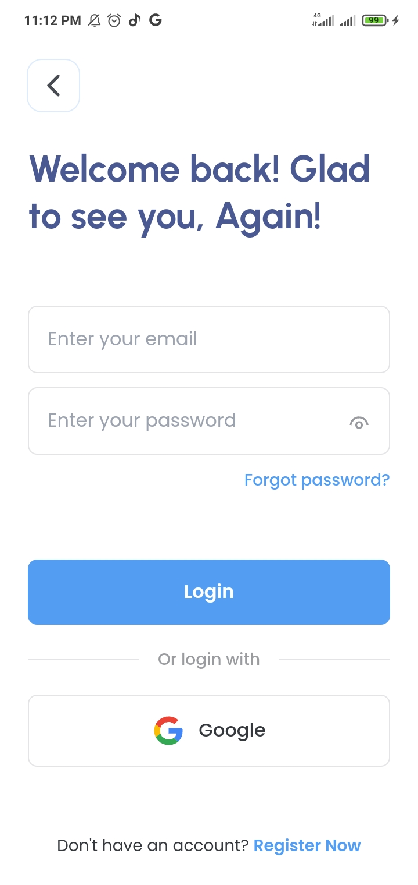
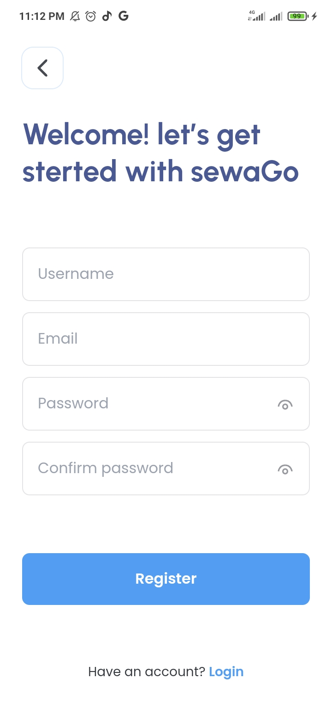
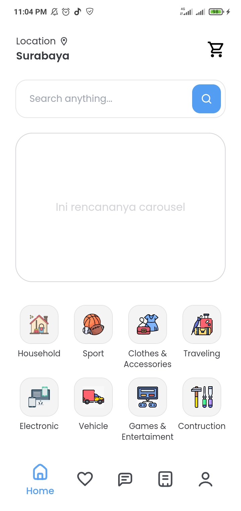

# SewaGo UI

## Page yang baru diselesaikan
### Login Page

Di bagian ini user bisa melakukan login melalui native ataupun dari google. Masing masing cara tersebut dilakukan dari sisi front-end dengan API firebase yaitu "signInWithEmailAndPassword" dan "signInWithPopup", dengan mengembalikan data user yang login. Tetapi tidak sampai di situ saja, Front-end akan mengambil token user dari firebase, lalu diteruskan ke back-end (proses back-end akan dibahas di repository back-end sendiri). Setelah back-end memproses, user akan menerima request token tersendiri dari app SewaGo, bukan dari firebase.

### Register Page

Di page ini mekanisme nya juga hampir sama dengan page login, hanya saja front-end tidak bisa membuat langsung sebuah user baru, jadi dari front-end akan mengirim data tersebut ke back-end untuk melakukan pendaftaran. Setelah selesai, user bisa mulai login.

### Register Page

Di page home masih belum ada logic app nya, karena keterbatasan waktu dan tenaga kerja.

